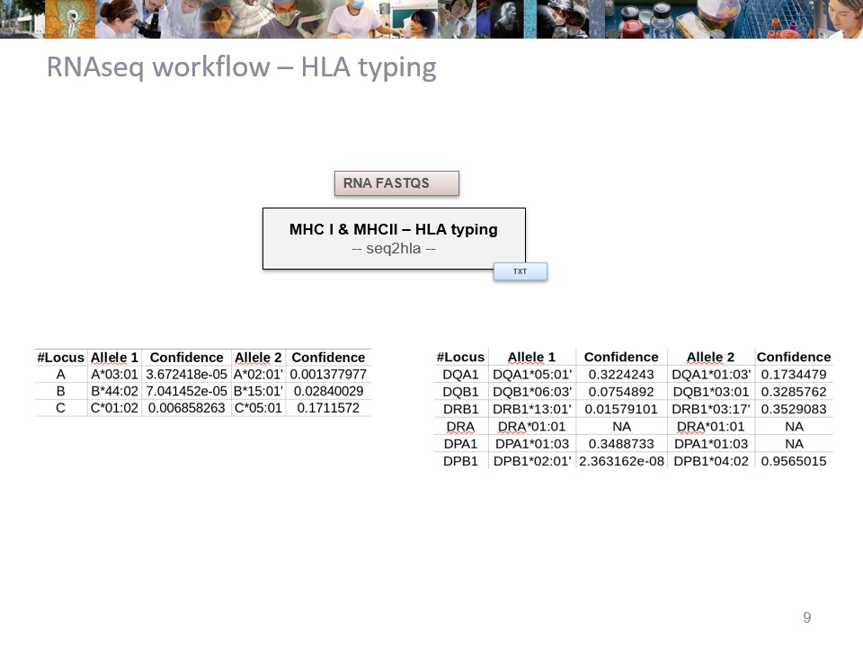

# nf-neoant
Detection of neoantigens from WES and RNA sequencing data
=======
# nf-neoAnt pipeline 

[](https://www.nextflow.io/)
[](https://conda.anaconda.org/anaconda)
[](https://singularity.lbl.gov/)
[](https://www.docker.com/)

## Introduction

The pipeline is built using [Nextflow](https://www.nextflow.io), a workflow manager to run tasks across multiple compute infrastructures in a very portable manner.
It supports [conda](https://docs.conda.io) package manager and  [singularity](https://sylabs.io/guides/3.6/user-guide/) / [Docker](https://www.docker.com/) containers making installation easier and results highly reproducible.

## Pipeline summary

The objective of the pipeline is to predict tumor-specific neoantigen based on both DNA and RNA next generation sequencing data from patients.
<!-- 
* HLA typing are divided into two parts:
    - [Optitype](https://github.com/FRED-2/OptiType) (v1.3.5) for MHCI, based on the [nf-core hlatyping pipeline](https://nf-co.re/hlatyping/2.0.0)
    - [HLA-LA](https://github.com/DiltheyLab/HLA-LA) (v1.0.3) for MHCII
 -->
* HLA typing is performed by [seq2HLA](https://github.com/TRON-Bioinformatics/seq2HLA) (v2.2) on both MHCI and MHCII, based on the paired RNA fast files.

* Detection of neoantigen is performed by the [pVACtools suite](https://pvactools.readthedocs.io) (v4.1.1). The pipeline is divided into two parts, one focusing on DNA-based analysis (pVACseq) and the other one based on fusions events derived from RNAseq data (pVACfuse).

* [MiXCR](https://github.com/milaboratory/mixcr) (v4.5.0) was added to provide a fast analysis of raw T- or B- cell receptor repertoires. 

### pVACseq

* Paired RNAseq reads are aligned using [STAR](https://github.com/alexdobin/STAR) (v2.7.6a) on the STAR index using the --quantMode TranscriptomeSAM option to obtain a transcriptome-based alignments BAM file. Per gene and per transcript TPM (transcript per million) are then estimated using [Salmon](https://github.com/COMBINE-lab/salmon) (v1.10.2) with the adequate Gencode GFF3 and transcripts fasta files.

* Small somatic variants (snvs, indels) were first called using the [GATK](https://gatk.broadinstitute.org/hc/en-us) Mutect2 (v4.1.8.0). 
    - Variants were annotated using [VEP](http://useast.ensembl.org/info/docs/tools/vep/script/index.html) (ENSEMBL v110.1).
    - Both gene (GX) and transcript (TX) expressions were then added using [vatools](https://github.com/griffithlab/VAtools) (v5.1.0) and previously computed expression files
    - RNA depth (RDP) and RNA allelic ratio (RAF) were then added using a combination of [bcftools](https://github.com/samtools/bcftools) (v1.15.1), GATK SelectVariants (v4.1.9.0) and [bam-readcount](https://github.com/genome/bam-readcount) (v0.8).

* [pVACseq](https://pvactools.readthedocs.io/en/latest/pvacseq.html) was then run using HLA typing files (for MHCI & MHCII) on the resulting variant file.

### pVACfuse

* [Arriba](https://github.com/suhrig/arriba) (v2.4.0) was run on a subset of the original STAR aligned file containing only reads of putative relevance to fusion detection, such as unmapped and clipped reads.
* [pVACfuse](https://pvactools.readthedocs.io/en/latest/pvacfuse.html) was then run on the list of filtered fusions of interest, using both HLA typing files. 


#### Workflow




#### Run the pipeline from a sample plan

#### Arguments & Parameters

- sample_plan: csv file containing per-row samples information

- assembly: the genome assembly for the analysis (example: hg38)
- genomePath: path containing the different files described in "conf/genomes.config"

<!-- - condaCacheDir: path to store conda environments -->
- singularityImagePath: path to singularity images

- vep_dir_cache: path to the downloaded VEP cache from those [instructions](http://useast.ensembl.org/info/docs/tools/vep/script/vep_cache.html#cache) (here: species="homo_sapiens" & version="110_GRCh38")
- vep_plugin_repo: path to the [VEP_plugins](https://github.com/Ensembl/VEP_plugins.git) repository in which the [Frameshift.pm](https://raw.githubusercontent.com/griffithlab/pVACtools/v2.0.0/tools/pvacseq/VEP_plugins/Frameshift.pm) was downloaded.

<!-- - vt: path to the binary of the vt tools from github
 -->
<!-- - graph_dir: path to the graph directory for HLA-LA -->
<!-- - graph_name : name of the graph for HLA-LA (PRG_MHC_GRCh38_withIMGT) -->

- blacklist_tsv: file obtained from downloading [arriba archive](https://github.com/suhrig/arriba/releases) (in the /database  folder) called "blacklist_${assembly}*.tsv.gz"

- proteinGff: file obtained from downloading [arriba archive](https://github.com/suhrig/arriba/releases) (in the /database  folder) called "protein_domain_${assembly}*.gff3"

<!-- - iedb_path: path to the uncompressed [MHCI](https://downloads.iedb.org/tools/mhci/) & [MHCII](https://downloads.iedb.org/tools/mhcii/) IEDB archives. Warning: the path must be shorter than 57 characters  -->

- mi_license: path to the "mi.license" file neeeded for mixcr, free for [academic](https://licensing.milaboratories.com/)

- tmpdir: path to temporary folder

```bash
nextflow run main.nf --samplePlan ${sample_plan} \
                     --genome ${assembly} \
                     --genomeAnnotationPath ${genomePath} \
                     --outDir ${outputDir} \
                     --singularityImagePath ${sif} \
                     --vepDirCache ${vep_dir_cache} \
                     --vepPluginRepo ${vep_plugin_repo} \
                     --miLicense ${mi_license} \
                     --tmpdir ${tmpdirp} \
                     -profile singularity,cluster \
                     -w ${tmp_dir} \
                     -resume
```

### Sample plan

A sample plan is a csv file (comma separated) that lists all the samples with a biological IDs.
The sample plan is expected to contain the following fields (with no header):

```
sampleID, sampleName, normalName, path_to_fastqDnaR1, path_to_fastqDnaR2, path_to_sampleDnaBam, path_to_sampleDnaBamIndex, path_to_vcf,  path_to_fastqRnaR1, path_to_fastqRnaR2, path_to_sampleRnaBam, path_to_sampleRnaBamIndex
```


### Steps

Basic steps are the following: HLAtyping, RNAquant, pVacseq, pVacfuse, mixcr.
They can be use separately (e.g.: --step HLAtyping or --step RNAquant or --step mixcr) or combined partially (e.g.: --step HLAtyping,RNAquant,pVacseq ;  --step HLAtyping,pVacfuse) or all together (default mode ; --step HLAtyping, RNAquant, pVacseq, pVacfuse, mixcr) using the --step option. 

#### HLA typing

If you only want to get HLA alleles (MHCI & MHCII), add the step "--step HLAtyping" to your command line. If you already have the two HLA allele files (MHCI & MHCII), add the full path to the sample plan as follow:

```
sampleID, sampleName, normalName, path_to_fastqDnaR1, path_to_fastqDnaR2, path_to_sampleDnaBam, path_to_sampleDnaBamIndex, path_to_vcf,  path_to_fastqRnaR1, path_to_fastqRnaR2, path_to_sampleRnaBam, path_to_sampleRnaBamIndex,path_to_HLAI_file,path_toHLAII_file
```

#### RNA expression

If you only want to get transcript/gene based expression files (tpm), add the step "--step RNAquant" to your command line. If you already have the two gene-based and transcript-based expression files, add the full path to the sample plan as follow:


```
sampleID, sampleName, normalName, path_to_fastqDnaR1, path_to_fastqDnaR2, path_to_sampleDnaBam, path_to_sampleDnaBamIndex, path_to_vcf,  path_to_fastqRnaR1, path_to_fastqRnaR2, path_to_sampleRnaBam, path_to_sampleRnaBamIndex,path_to_HLAI_file,path_toHLAII_file,path_to_gene_tpm_file,path_to_transcript_tpm_file
```

or, if you want to run the HLAtyping step (--step HLAtyping,RNAquant,pVacseq)
```
sampleID, sampleName, normalName, path_to_fastqDnaR1, path_to_fastqDnaR2, path_to_sampleDnaBam, path_to_sampleDnaBamIndex, path_to_vcf,  path_to_fastqRnaR1, path_to_fastqRnaR2, path_to_sampleRnaBam, path_to_sampleRnaBamIndex,,,path_to_gene_tpm_file,path_to_transcript_tpm_file
```

### Test

Run the pipeline on the test dataset that will launch HLAtyping: 


```bash
nextflow run main.nf -profile test,singularity --outDir ${outputDir} --singularityImagePath ${sif} -w ${work_dir}
```


## Credits

This pipeline has been written by Institut Curie bioinformatics platform CUBIC (E.Girard, N.Servant). The project was funded by IMMUcan, the integrated European immuno-oncology profiling platform. 

## Contacts

For any question, bug or suggestion, please use the issue system or contact the bioinformatics core facility.
